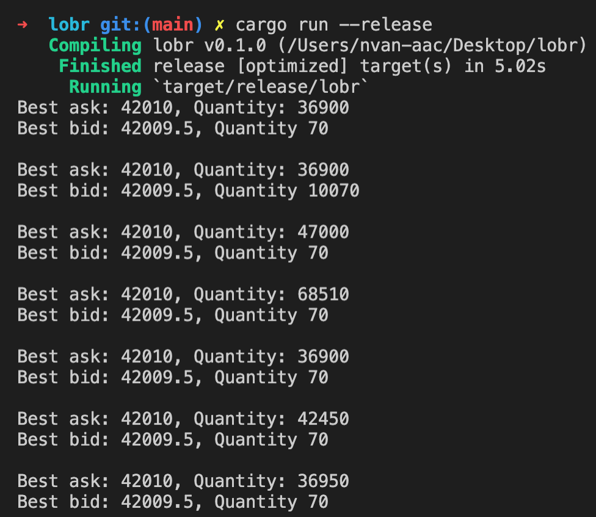

# Limit Order Book Reconciliation

## D2X Technical Interview


## About The Project
<p>
This program connects to the Derebit Websocket API and subscribes to the book.BTC-PERPETUAL.100ms. <br>
The first snapshot of the Limit Order Book and its subsequent deltas are ordered in two binary tree maps.<br>
 These hold the Price/Quanitity values of the asks and the bids.<br>
The Snapshot gives the current state of the book.<br>
The subsequent deltas can change the Limit Order Book in 3 different ways: <br>

* **New**
    * Insert a new price level with the corresponding quantity
* **Delete**
    * Remove a price level from the Limit Order Book
* **Change** 
    * Change the quantity of a price level

The best bid/ask price is printed out each second with the corresponding quantities.<br>
When the expected package isn't received, the program reconnects with the API and starts with a new snapshot.
</p>
<br>

### Built With Rust Crates
<br>

* [Tungstenite](https://docs.rs/tungstenite/latest/tungstenite/)
* [Serde](https://docs.serde.rs/serde/index.html)
* [Serde_json](https://docs.serde.rs/serde_json/macro.json.html)
* [ordered-float](https://docs.rs/ordered-float/latest/ordered_float/)
<br>

## Installation
<br>

1. Install rust
  ```sh
  $ curl https://sh.rustup.rs -sSf | sh
  ```
2. Add the following line to your ~/.bash_profile  
  ```sh
  export PATH="$HOME/.cargo/bin:$PATH
  ```
3. Update rust to the latest version with
  ```sh
  rustup update
  ```
  4. Clone the repo
   ```sh
   git clone https://github.com/vanaacken/lobr.git 
   ```
   5. Navigate to the repo
   ```sh
    cd lobr
   ```

<br>

## Usage
<br>
when in the root of the project run

```sh
cargo run --release
```

<br>

## Example Output


<br><br>

## Future Improvements
* Testing
    * Unit Testing for the individual insert / deletes / changes in the Binary trees
    * Testing the reconnection with an incorrect change_id

<br><br>


## Contact

Niels van Aacken - [@nielsvanaacken](https://www.linkedin.com/in/nielsvanaacken/) - nielsfhvanaacken@gmail.com

Project Link: [https://github.com/vanaacken/Limit-Order-Book-Reconciliation ](https://github.com/vanaacken/Limit-Order-Book-Reconciliation )